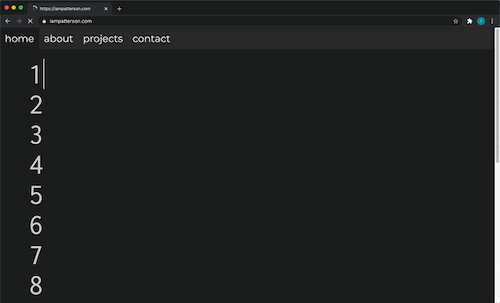

# portfolio-website
When I was tasked with creating a portfolio website, the first thing I did was to google "Web design trends 2020" (please, forgive me for my lack of creativity but we all have to start somewhere). Some of the top results immediately brought something to mind – an IDE! Dark mode; Split screen content; Solid color blocks; Plenty of whitespace; Oversized type and elements; I would use HTML and CSS to recreate the feel of an IDE and JavaScript to bring it to life.



## HTML and CSS
I used multiple <span> tags with dedicated classes per line to style the text with CSS as it might appear in an IDE set to dark mode. Instead of typing the text to be displayed between each tags, I set it as the value of a data attribute that I named data-text. This way, I could easily pass the strings to my JavaScript function and manipulate how the text was displayed

```html
<div id="home">
                <div class="text-container">
                    <div class="hi">
                        &nbsp;1 <span class="typewriter blue" data-text="&lt;div "></span><span class="typewriter lgblue" data-text="id="></span><span class="typewriter orange" data-text="&quot;hi&quot;"></span><span class="typewriter blue" data-text="&gt;"></span><br>
                        &nbsp;2 &ensp;<span class="typewriter blue" data-text="&lt;h1&gt;"></span><br>
                        &nbsp;3 &ensp;&ensp;<span class="typewriter" data-text="I'm "></span><span class="smscreen"><span class="typewriter blue break" data-text="&lt;br&gt;"></span><br>
                        &nbsp;<span class="hide">3</span>&nbsp;&ensp;&ensp;</span><span class="typewriter myName" data-text="Ian Patterson" data-wait="1500" onclick="init()"></span><br>
                        &nbsp;4 &ensp;<span class="typewriter blue" data-text="&lt;/h1&gt;"></span><br>
                        &nbsp;5 &ensp;<span class="typewriter blue" data-text="&lt;button&gt;"></span><br>
                        &nbsp;6 &ensp;&ensp;<a href="#about" class="button">
                            <span class="typewriter" data-text="check me out"></span>
                        </a><br>
                        &nbsp;7 &ensp;<span class="typewriter blue" data-text="&lt;/button&gt;"></span><br>
                        &nbsp;8 <span class="typewriter blue" data-text="&lt;/div&gt;"></span><br>&nbsp;9<br>10<br>11<br>12<br>13<br>14<br>15<br>16<br>17
                    </div>
                </div>
            </div>
```

## JavaScript
